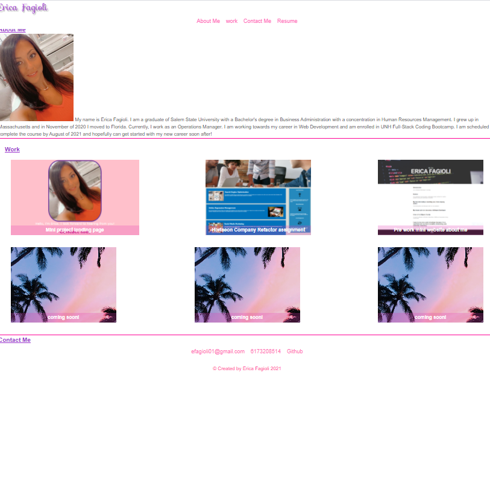

# Erica-Fagioli-Career-Portfolio

For this second homework assignment in week two of UNH Full-Stack Coding Bootcamp, I was able to build the foundation of a portfolio with the material I was taught over the first two weeks.

I have created a fully responsive portfoilo website that showcases the projects I have worked on thus far. 

I added links to the navigation bar so when the links are clicked on the UI scrolls to the corresponding section. 

When the link for my work is clicked on the UI scrolls to a section with images and titles of my work.

When the picture is clicked on, the UI is taken to Github to view the deployment.

I have added hover effets on my Navigation bar and my contact links. The hover effect adds a transition of color to my links when the user clicks them to more easily direct them. 

## Built with

* HTML
* CSS
* Foundation

## Links

* [GitHub Repository](https://github.com/efagioli01/Erica-Fagioli-Career-Portfolio)
* [Deployed Application](https://efagioli01.github.io/Erica-Fagioli-Career-Portfolio/)

## Screenshot 
 

 ## LICENSE

 MIT License

Copyright (c) [2021] [Erica Fagioli] 

Permission is hereby granted, free of charge, to any person obtaining a copy of this software and associated documentation files (the "Software"), to deal in the Software without restriction, including without limitation the rights to use, copy, modify, merge, publish, distribute, sublicense, and/or sell copies of the Software, and to permit persons to whom the Software is furnished to do so, subject to the following conditions:

The above copyright notice and this permission notice shall be included in all copies or substantial portions of the Software.

THE SOFTWARE IS PROVIDED "AS IS", WITHOUT WARRANTY OF ANY KIND, EXPRESS OR IMPLIED, INCLUDING BUT NOT LIMITED TO THE WARRANTIES OF MERCHANTABILITY, FITNESS FOR A PARTICULAR PURPOSE AND NONINFRINGEMENT. IN NO EVENT SHALL THE AUTHORS OR COPYRIGHT HOLDERS BE LIABLE FOR ANY CLAIM, DAMAGES OR OTHER LIABILITY, WHETHER IN AN ACTION OF CONTRACT, TORT OR OTHERWISE, ARISING FROM, OUT OF OR IN CONNECTION WITH THE SOFTWARE OR THE USE OR OTHER DEALINGS IN THE SOFTWARE.