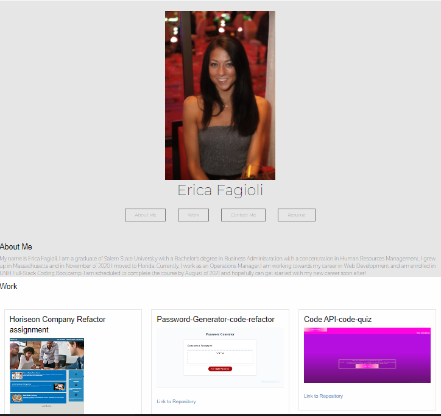

# Erica-Fagioli-Career-Portfolio

For this  homework assignment in week seven of UNH Full-Stack Coding Bootcamp, I was to make updates to the  portfolio i built in week two of the program with the material I was taught over the first two weeks.

I have created a fully responsive portfoilo website that showcases the homework and projects I have worked on thus far, I switcheed my styling with Bootstrap and used foundation since I was to learn a new CSS framework for the 1st project and foundation was the framework i chose.

 links to the navigation bar so when the links are clicked on the UI scrolls to the corresponding section. 

When the link for my work is clicked on the UI scrolls to a section with images and titles of my work. On each image of my work the user is able to click on it and is taken to the deployed page. There is also a link to the repository under each image.

I have added hover effets on my Navigation bar and my contact links. The hover effect adds a transition of color to my links when the user clicks them to more easily direct them. 

## Additions
updated reume with a clickable link in the portfolio
updated linkedin with a clickable link in the portfolio
updated Githb account with a picture, two pinned homework assignments and a pin for project 1

## Built with

* HTML
* CSS
* Foundation

## Links

* [GitHub Repository](https://github.com/efagioli01/Erica-Fagioli-Career-Portfolio)
* [Deployed Application](https://efagioli01.github.io/Erica-Fagioli-Career-Portfolio/)

## Screenshot 
 

 ## LICENSE

 MIT License

Copyright (c) [2021] [Erica Fagioli] 

Permission is hereby granted, free of charge, to any person obtaining a copy of this software and associated documentation files (the "Software"), to deal in the Software without restriction, including without limitation the rights to use, copy, modify, merge, publish, distribute, sublicense, and/or sell copies of the Software, and to permit persons to whom the Software is furnished to do so, subject to the following conditions:

The above copyright notice and this permission notice shall be included in all copies or substantial portions of the Software.

THE SOFTWARE IS PROVIDED "AS IS", WITHOUT WARRANTY OF ANY KIND, EXPRESS OR IMPLIED, INCLUDING BUT NOT LIMITED TO THE WARRANTIES OF MERCHANTABILITY, FITNESS FOR A PARTICULAR PURPOSE AND NONINFRINGEMENT. IN NO EVENT SHALL THE AUTHORS OR COPYRIGHT HOLDERS BE LIABLE FOR ANY CLAIM, DAMAGES OR OTHER LIABILITY, WHETHER IN AN ACTION OF CONTRACT, TORT OR OTHERWISE, ARISING FROM, OUT OF OR IN CONNECTION WITH THE SOFTWARE OR THE USE OR OTHER DEALINGS IN THE SOFTWARE.